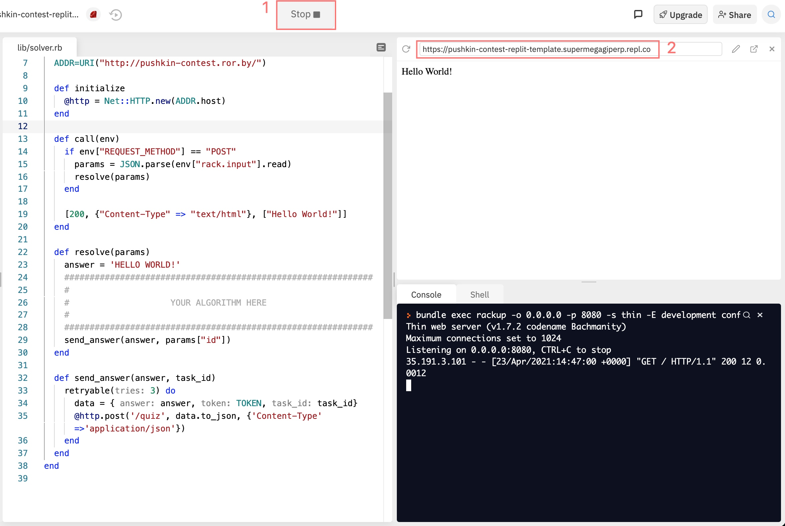

# [Replit Template] Pushkin Contest

## 1. Setup quize solver

1. Fork [repository with task pattern](https://github.com/rubyroidlabs/pushkin-contest-replit-template).
1. Open [replit.com](replit.com).
1. Authorize in Replit via Github account.
1. Click "New repl" -> "Import from GitHub" -> pass link to your fork.
1. Enjoy!

OR just create a new Ruby Repl and copy files.

## 2. Quize registration

1. Run this code in Replit.
1. Wait until server has started.
1. Then Replit's browser frame opens above console. Copy link from it and use it for registration in the system.

1. Open [Quize server](http://pushkin-contest-hexlet.rubyroidlabs.dev/).
1. Register with link of your replit server.
1. Copy generated token to `lib/solver.rb#6:10`

## 3. Develop

Quize server sends POST requests with quize task to your Replit server. Your server should solve this task and make POST request to the Quize server with the answer. Check `lib/solver.rb` for details!

Your task is to change Solver's code in that way, when it solves all quize tasks correctly and fastly.

All needed data you can find in `data/`.
